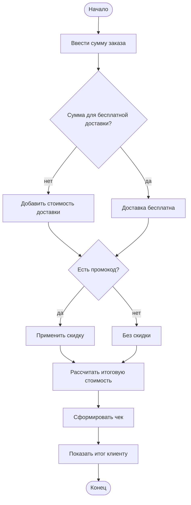

# Flowchart — Расчёт итоговой стоимости заказа

Блок-схема алгоритма расчёта стоимости заказа с проверкой условий (бесплатная доставка, промокод).

```mermaid
flowchart TD
    A([Начало]) --> B[Ввести сумму заказа]
    B --> C{Сумма для бесплатной доставки?}
    C -- нет --> D[Добавить стоимость доставки]
    C -- да --> E[Доставка бесплатна]
    D --> F{Есть промокод?}
    E --> F
    F -- да --> G[Применить скидку]
    F -- нет --> H[Без скидки]
    G --> I[Рассчитать итоговую стоимость]
    H --> I
    I --> L[Сформировать чек]
    L --> J[Показать итог клиенту]
    J --> K([Конец])
```
