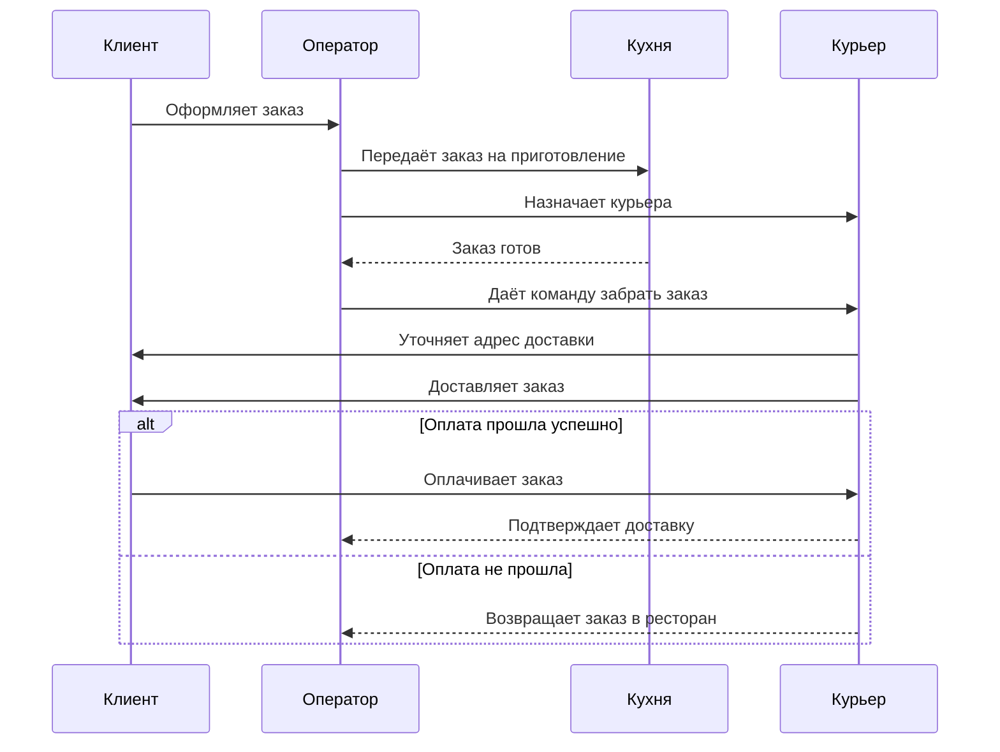

# Sequence Diagram — Заказ еды в ресторане с доставкой

Диаграмма последовательности: обмен сообщениями между участниками процесса.

```mermaid
sequenceDiagram
    participant Клиент
    participant Оператор
    participant Кухня
    participant Курьер

    Клиент->>Оператор: Оформляет заказ
    Оператор->>Кухня: Передаёт заказ на приготовление
    Оператор->>Курьер: Назначает курьера
    Кухня-->>Оператор: Заказ готов
    Оператор->>Курьер: Даёт команду забрать заказ
    Курьер->>Клиент: Уточняет адрес доставки
    Курьер->>Клиент: Доставляет заказ
    alt Оплата прошла успешно
        Клиент->>Курьер: Оплачивает заказ
        Курьер-->>Оператор: Подтверждает доставку
    else Оплата не прошла
        Курьер-->>Оператор: Возвращает заказ в ресторан
    end
```
