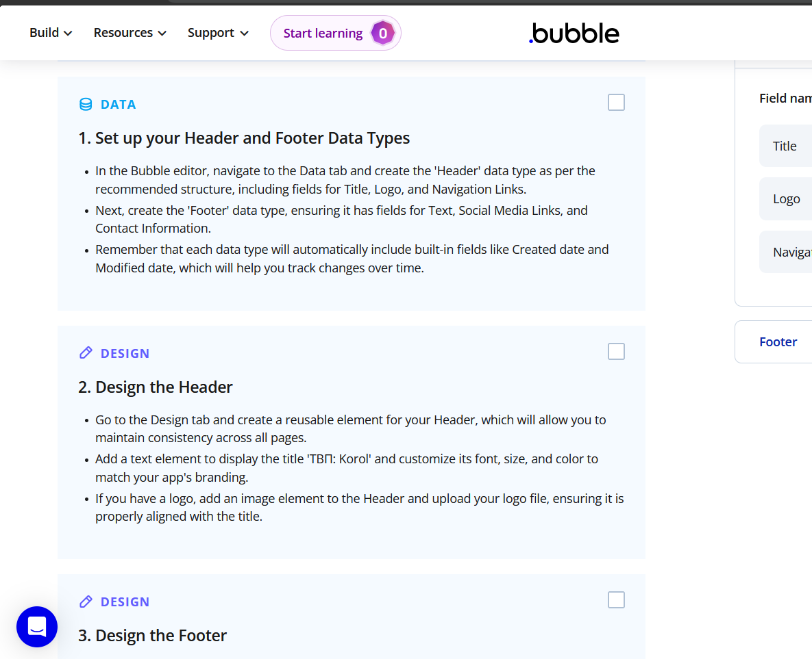
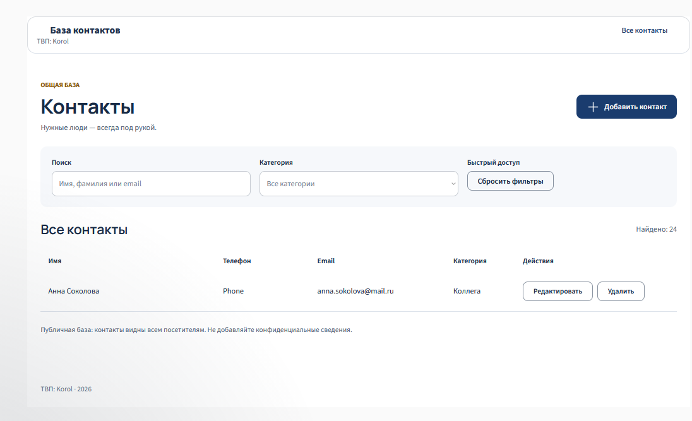
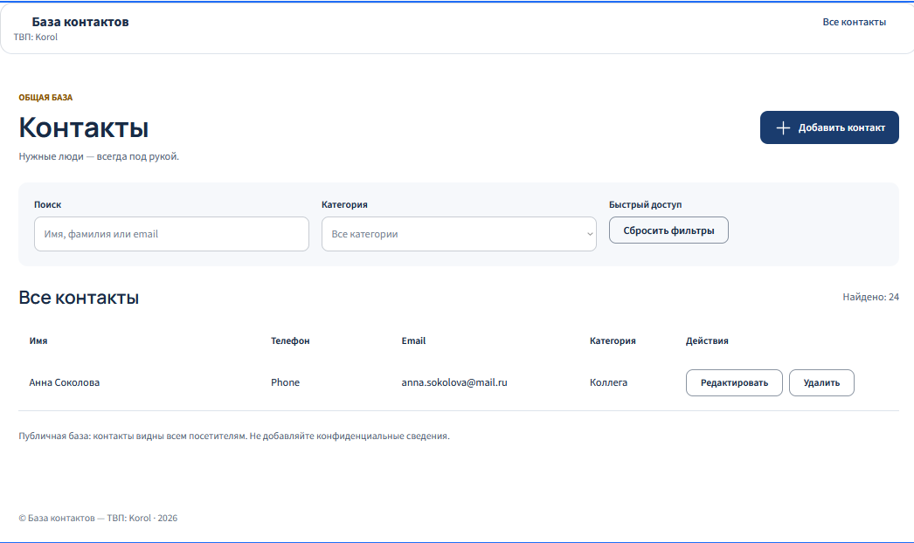

# Отчёт по лабораторной работе №3 «Bubble»

Студент: **Korol**, группа: **ИИ-241**
Репозиторий: `visual-programming-labs-Korol`, папка работы: `lab3/`

---

## 1. Краткое описание выполненного

Тема приложения — **«База контактов»** (публичный сайт, без регистрации).

Создано no-code приложение на платформе Bubble (бесплатный план):
- **Часть 1** — каркас сгенерирован AI-агентом Bubble по промпту (см. раздел 2);
- **Часть 2** — изучен Build Guide про Header/Footer и применена идея
  «динамический футер из базы» (см. раздел 8);
- **Часть 3** — UI доработан вручную (заголовок, Global variable, стиль, компонент);
- **Часть 4** — Data Type «Контакт» и полный CRUD через workflows.

---

## 2. Промпт дословно (Часть 1)

```
Создай приложение на тему «База контактов».
Пусть этот сайт будет публичный (без регистрации).
Страницу обязательно создай по структуре header + body + footer.
Обязательно укажи в заготовке следующую строку: «ТВП: Korol».
Добавь несколько интерактивных элементов, реализующих CRUD:
добавление, просмотр списка, редактирование и удаление контактов.
```

---

## 3. Ссылка на dev-версию приложения

_<!-- ВПИСАТЬ: dev-ссылку. В Bubble: Settings → General → "Share" / "Application link",
либо кнопка Preview → "Open in new tab" и скопировать URL -->_

---

## 4. Какие AI-промпты использовались (дословно)

### 4.1 Промпт для генерации каркаса (Часть 1)
см. раздел 2 — промпт вставлен в AI-агента Bubble.

### 4.2 Промпт для сущности в Части 4.1
```
Придумай сущность для приложения «База контактов».
Название сущности — Contact (Контакт).
Добавь минимум 3 поля разных типов: имя (текст), телефон (текст),
дата рождения (дата), избранный (да/нет), email (текст).
```

### 4.3 Промпты из исследования идеи (Часть 2)
Для изучения Build Guides и применения идеи «динамический футер» использовался
AI-агент Bubble (встроенный в редактор) с запросом по структуре Header/Footer.
В запросе AI предложил: создать data type `FooterContent` с полями `text` (текст)
и `year` (число), сделать его публично читаемым (сайт без регистрации), добавить
одну запись и привязать текст футера к данным, чтобы менять содержимое в
Data → App data без правки дизайна. Эта идея применена в приложении.

---

## 5. Какие элементы и workflows освоены

_<!-- ВПИСАТЬ после выполнения: элементы (input, button, repeating group, popup, ...),
workflows (Create, Read, Update, Delete), Global variables, styles -->_

---

## 6. Скриншоты всех шагов

| № | Файл | Что на снимке |
|---|---|---|
| 1 | `screenshots/01-prompt.png` | результат генерации каркаса по промпту |
| 2 | `screenshots/02-buildguide-1.png` | изученный Build Guide (Header/Footer) |
| 2 | `screenshots/02-before.png`, `screenshots/02-after.png` | футер до/после подключения к данным |
| 3 | `screenshots/03-global-variable.png` | Global variable (Color) + применение |
| 4 | `screenshots/04-style.png` | новый стиль с использованием переменной |
| 5 | `screenshots/05-component.png` | готовый компонент на странице |
| 6 | `screenshots/06-data-type.png` | Data Type «Контакт» и его поля |
| 7 | `screenshots/07-data-records.png` | записи в App Data |
| 8 | `screenshots/08-workflow-create.png` | workflow Create |
| 9 | `screenshots/09-workflow-update.png` | workflow Update |
| 10 | `screenshots/10-workflow-delete.png` | workflow Delete |

---

## 8. Исследование идеи (Часть 2)

Изучен Build Guide на bubble.io/home/buildguides по теме оформления
Header и Footer приложения.

### Что посмотрели

Гайд, который разбирает структуру сайта на три зоны (header + body + footer) и
показывает, как оформить заголовок и подвал через переиспользуемые элементы и
подключение данных.



### Что показалось полезным

Идея, что текст футера не обязательно зашивать в дизайн руками — его можно хранить
в базе данных и выводить динамически. Тогда контент меняется в одном месте
(Data → App data), а не переделыванием каждой страницы.

### Что взяли в своё приложение

Реализован **динамический футер на данных**:

1. Создан data type `FooterContent` с полями `text` (текст) и `year` (число) —
   тип `Contact` при этом не затрагивается.
2. Добавлена одна запись: `text` = «© База контактов — ТВП: Korol», `year` = 2026.
3. Тип `FooterContent` сделан публично читаемым (сайт открыт без регистрации).
4. В футере статичный текст заменён на динамический — «первый `FooterContent`'s
   text · первый `FooterContent`'s year». Workflow «Page is loaded» не понадобился:
   текстовый элемент сам читает значение из базы.

Футер теперь показывает «© База контактов — ТВП: Korol · 2026», а поменять текст
или год можно в Data → App data, не редактируя дизайн.

### До / после

**До** (статичный текст футера):



**После** (текст берётся из data type `FooterContent`):



## 7. Выводы своими словами

_<!-- ВПИСАТЬ после выполнения -->_
